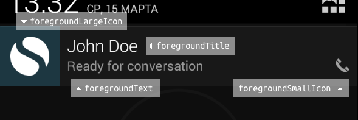

# Android background service

In order to accpet incoming calls while applicaiton in background you should set `foreground` property to `true`.
When this flag is true, pjsip service will create a `pending notification`.



```javascript
let configuration = {
  ua: Platform.select({ios: "Reachify iOS", android: "Reachify Android"}), // Default: React Native PjSip (version)
  foreground: true, // Enable ability to connect to SIP while in background
  foregroundTitle: "Reachify", // Default: account name
  foregroundText: "Online",    // Default: account registration status
  foregroundInfo: null,
  foregroundTicker: null,
  foregroundSmallIcon: null,
  foregroundLargeIcon: null    // Default: ic_launcher
};
let endpoint = new Endpoint();
let state = await endpoint.start(configuration);
// ...
```

### Small and large icons

Copy your icons to `android/app/src/main/res/mipmap-XXXX/` and set thier names into `foregroundSmallIcon` and `foregroundLargeIcon` without extension.
https://developer.android.com/guide/practices/ui_guidelines/icon_design_status_bar.html


# Call notifications

Android service by default creates notification that outgoing or incoming are in progress.
In order to disable this functionality or customize it use configuration as in example below.

```javascript
let configuration = {
  ua: "..."
  // ....
  foregroundCallNotifications: true, // True to show notifications for calls
  foregroundCallNotificationsInfo: (call) => { // Detailed info how to show notification
    return {
      title: "Call from John Doe",
      text: "Ringing",    // Default: account registration status
      info: null,
      ticker: null,
      smallIcon: "icon_call",
      largeIcon: "avatar_of_user"
    }
  })
};
let endpoint = new Endpoint();
let state = await endpoint.start(configuration);
// ...
```

### Handle clicks to call notifications

Typically you should contain code that will change "route" in react-native app depending on result of `endpoint.start` command
```javascript
let state = await endpoint.start(configuration);
let calls = state.calls; // A list of active calls

if (state.hasOwnProperty("notificationCallId")) {
    for (let c of calls) {
        if (c.getId() == state['notificationCallId']) {
            route = {name:'call', call: c};
            break;
        }
    }
}

//...

// If true you should use slider instead of buttons for incoming call, because device was in sleep when this call comes.
if (state.notificationIsFromForeground) {
  //...
}
```
