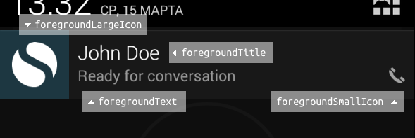

# Android background service

In order to accept incoming calls while applicaiton in background you should set `notifications` property to `true` (true by default).
This will make PJSIP service run in the *foreground*, supplying the ongoing notification to be shown to the user while in this state.
Without foreground notification, Android could kill PJSIP service to reclaim more memory.



```javascript
let configuration = {
  service: {
    ua: Platform.select({ios: "Reachify iOS", android: "Reachify Android"}), // Default: React Native PjSip (version)
    notifications: true,  // Creates peding notification that will allow service work while your app in background
    notifications: false, // Disables pending notification
    notifications: {      
      account: true,
      call: false         // Disables only call notification
    },
    notifications: {
      account: {
        title: "My cool react native app", // Default: account name
        text: "Here we go",    // Default: account registration status
        info: null,
        ticker: null,
        smallIcon: null,
        largeIcon: null 
      },
      call: {
        title: "Active call",   // Default: "Call in Progress - %Account Name%"
        text: "John Doe",       // Default: "%Caller Name% (%Number%)"
        info: null,
        ticker: null,           // Default: "Call in Progress"
        smallIcon: "icon_call", // Default: R.drawable.stat_sys_phone_call
        largeIcon: null
      }
    }
  },
  network: {
    useAnyway: false,           // Default: true
    useWifi: true,              // Default: true
    use3g: true,                // Default: false
    useEdge: false,             // Default: false
    useGprs: false,             // Default: false
    useInRoaming: false,        // Default: false
    useOtherNetworks: true      // Default: false
  }
};
let endpoint = new Endpoint();
let state = await endpoint.start(configuration);
// ...
```

### smallIcon & largeIcon
To use own images for nofitications, copy them into `android/app/src/main/res/mipmap-XXXX/` and set thier names into `smallIcon` and `largeIcon` without extension.
For more info: [ui_guidelines/icon_design_status_bar](https://developer.android.com/guide/practices/ui_guidelines/icon_design_status_bar.html)

### Handle clicks to call notifications

Typically you should contain code that will change "route" in react-native app depending on result of `endpoint.start` command
```javascript
let state = await endpoint.start(configuration);
let calls = state.calls; // A list of active calls

if (state.hasOwnProperty("notificationCallId")) {
    for (let c of calls) {
        if (c.getId() == state['notificationCallId']) {
            route = {name:'call', call: c};
            break;
        }
    }
}

//...

// If true you should use slider instead of buttons for incoming call, because device was in sleep when this call comes.
if (state.notificationIsFromForeground) {
  //...
}
```
